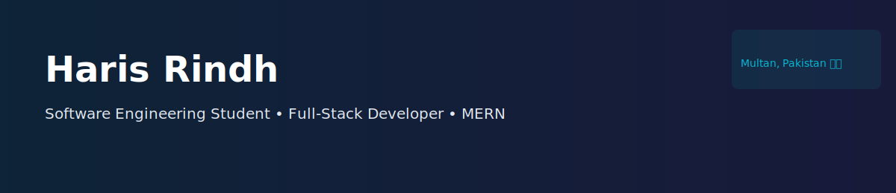

  <!-- Repo-hosted header image -->
  

# Hi there, I'm Haris Rindh 👋

**Software Engineering Student (6th Semester) @ Virtual University**  
Based in Multan, Pakistan 🇵🇰

[LinkedIn](https://www.linkedin.com/in/harisrindh) · haris.rindh.pk@gmail.com · [Fiverr](https://www.fiverr.com/haris_rindh)

---

## Table of Contents
- [About Me](#about-me)
- [Tech Stack](#tech-stack)
- [Project Showcase](#project-showcase)
- [Professional & Client Work](#professional--client-work)
- [Contact](#contact)
- [License](#license)

---

## 👨‍💻 About Me

I'm a Software Engineering student who bridges the gap between complex logic and business value. I focus on full‑stack (MERN) development and building resilient AI integrations such as failover architectures for AI APIs to improve uptime and reliability.

- Core Focus: MERN stack, full‑stack development  
- Professional Goal: Seeking a Summer 2026 internship (e.g., Systems Limited, NetSol)  
- Currently building: AI failover systems and UI-first SaaS experiences

---

## 🛠️ Tech Stack

Frontend
- React, React Three Fiber / three.js, Tailwind CSS, Framer Motion

Backend & Architecture
- Node.js, Express, MongoDB

Tools
- Postman, Git, VS Code

---

## 🏆 Project Showcase

### 🚀 Major Applications

| Project | Description | Repo / Live |
| --- | --- | --- |
| **Nexus AI** | SaaS LinkedIn content & carousel builder with an AI failover system that automatically switches providers (OpenAI → Anthropic / backups) to preserve continuity. Features post generation, content carousel builder, and scheduling. | Live: https://nexus-ai-mocha-phi.vercel.app/ · Repo: https://github.com/Haris-Rindh/NexusAI |
| **Book Sphere** | E‑Commerce / Library UI for browsing, searching, and managing books. Includes a backend search engine and a responsive catalog UI. | Live: https://haris-rindh.github.io/Book-Sphere/ · Repo: https://github.com/Haris-Rindh/Book-Sphere |
| **3D Portfolio** | Interactive developer portfolio with real‑time 3D rendering and physics-based animations (React + Three.js). | Live: https://harisrindh.netlify.app/ · Repo: https://github.com/Haris-Rindh/Old-Portfolio |

(For each project above, open the project's README for more details and "Run locally" steps.)

---

## 💼 Professional & Client Work (Fiverr / Harinova)
Representative client work:
- Real Estate Platform — image optimization + listing UX
- Dental Clinic Portal — appointment booking system
- Restaurant App — digital menu + reservation frontend
- Plumbing Service Site — local SEO optimized landing pages

---

  <h3>Let's Build Something Meaningful.</h3>
  
Open to inquiries regarding <b>Web Development</b>, <b>AI Integration</b>, or <b>Internship Opportunities</b>.

  

    <a href="https://www.linkedin.com/in/harisrindh">Connect on LinkedIn ➜</a>
  

---

## Contact
- Email: haris.rindh.pk@gmail.com  
- LinkedIn: https://www.linkedin.com/in/harisrindh  
- Fiverr: https://www.fiverr.com/haris_rindh

Open to Web Development, AI Integration, and Internship opportunities.

---

## License
This repository does not include a LICENSE file yet. Consider adding an MIT license if you want permissive reuse.
